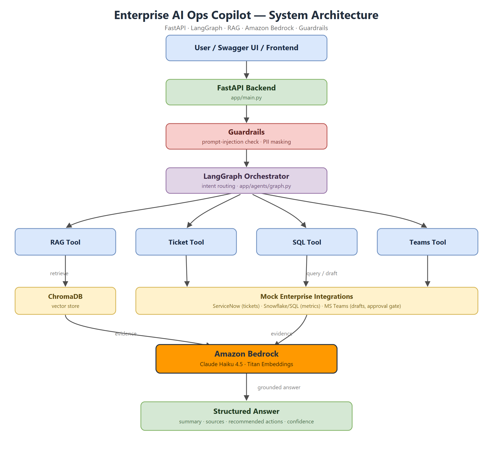
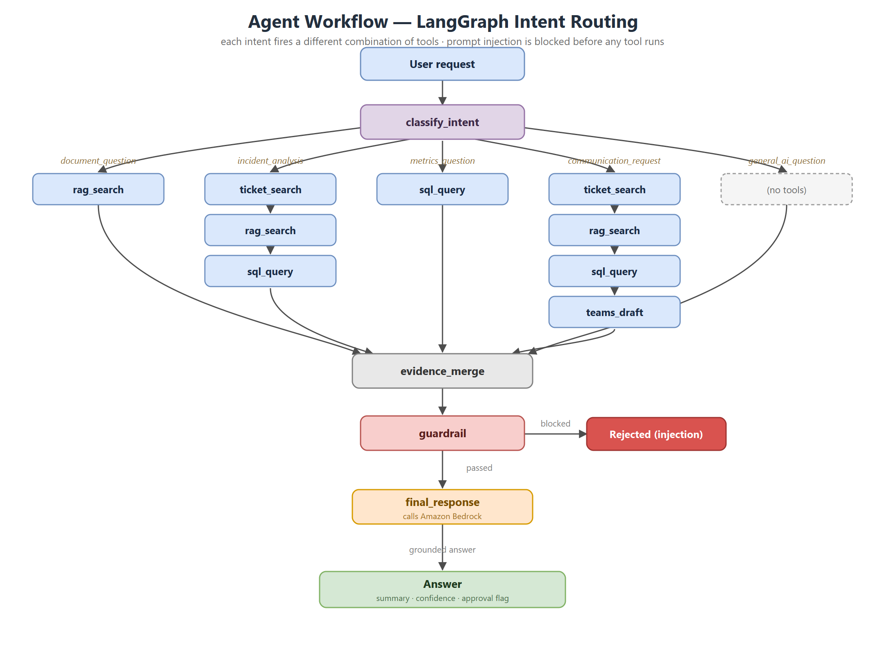
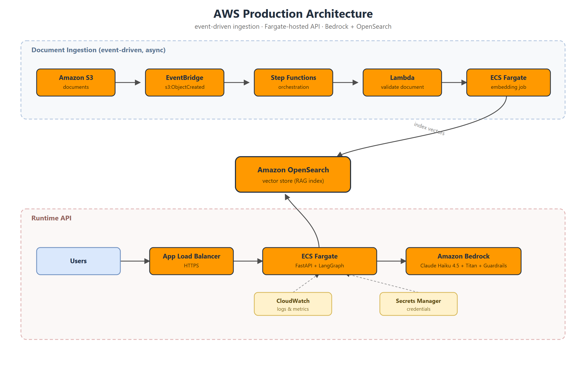

# Enterprise AI Operations Copilot

> **Production-style GenAI system** — Amazon Bedrock · FastAPI · LangGraph · RAG · Mock Enterprise Integrations · Guardrails · Evaluation


---

## Overview

Enterprise AI Operations Copilot is an AI assistant built for enterprise IT operations teams. It searches internal documents, analyzes incident tickets, queries structured operational data, and generates action recommendations using Amazon Bedrock foundation models.

This is not a simple chatbot. It is a multi-tool agentic system with a real data pipeline, guardrails, evaluation metrics, mock enterprise integrations, and AWS deployment architecture.

---

## Problem

Enterprise teams have information scattered across:

- Policy documents and runbooks
- Incident tickets (ServiceNow)
- Operational metrics (Snowflake / SQL)
- Team communication logs (MS Teams)
- Logs and reports

Employees waste time searching manually across these systems. This copilot solves that by connecting all sources into one intelligent interface.

---

## Example Use Case

**User asks:**
> "A payment API is failing with timeout errors. Find similar past incidents, summarize the likely root cause, and draft an update for the operations team."

**System does:**
1. Understand the user request and classify intent
2. Search internal runbooks and policy documents (RAG)
3. Search mock ServiceNow incident tickets
4. Query operational metrics from mock Snowflake/SQL
5. Generate a root cause summary grounded in retrieved evidence
6. Suggest recommended next actions
7. Draft a Microsoft Teams message
8. Apply guardrails (confidence check, PII masking, approval flag)
9. Return structured final answer with all sources

---

## Features

| Feature | What it demonstrates |
|---|---|
| AWS Bedrock LLM call | Bedrock hands-on experience |
| RAG pipeline | Embeddings + vector search + grounded answers |
| Document ingestion pipeline | Data pipeline engineering |
| LangGraph agent workflow | Multi-step agent orchestration |
| Mock ServiceNow integration | Enterprise system integration |
| Mock Snowflake / SQL integration | Structured data reasoning |
| Mock MS Teams integration | Business workflow automation |
| Guardrails layer | Responsible AI and safety |
| Evaluation system | AI quality monitoring |
| FastAPI backend | Production API development |
| Docker support | Deployment readiness |
| GitHub Actions CI/CD | Automated testing and build |
| AWS architecture design | Cloud-native AI system thinking |

---

## Project Status

All 13 implementation phases are complete. See [docs/running_guide.md](docs/running_guide.md) for per-phase setup and run commands.

| # | Phase | Status |
|---|---|---|
| 1 | FastAPI skeleton + health check | ✅ |
| 2 | AWS Bedrock connection | ✅ |
| 3 | Document ingestion pipeline | ✅ |
| 4 | Embeddings + vector store | ✅ |
| 5 | RAG chat endpoint | ✅ |
| 6 | Guardrails (injection + PII) | ✅ |
| 7 | Mock ServiceNow (15 tickets) | ✅ |
| 8 | Mock Snowflake/SQL (150+ metrics) | ✅ |
| 9 | Mock MS Teams (approval gate) | ✅ |
| 10 | LangGraph agent (5 intent paths) | ✅ |
| 11 | Evaluation system (20 test cases) | ✅ |
| 12 | Docker + GitHub Actions CI/CD | ✅ |
| 13 | AWS architecture + Terraform IaC | ✅ |

58 unit tests pass in CI on every push. Both GitHub Actions workflows (tests + Docker build) are green.

---

## System Architecture

A user question is classified, routed through the relevant tools, grounded in evidence, screened by guardrails, and answered by the LLM.



> Editable source: [system_architecture.drawio](docs/diagrams/system_architecture.drawio) (open in [draw.io](https://app.diagrams.net)) · [SVG](docs/diagrams/system_architecture.svg) · [PNG](docs/diagrams/system_architecture.png)

### Agent Workflow (LangGraph)

Intent classification routes each request to the right combination of tools. A communication request fires all four tools; a prompt injection is blocked before any tool runs.



> Editable source: [agent_workflow.drawio](docs/diagrams/agent_workflow.drawio) · [SVG](docs/diagrams/agent_workflow.svg) · [PNG](docs/diagrams/agent_workflow.png)

### AWS Production Architecture

The local stack (ChromaDB + mock integrations) maps onto managed AWS services. Documents land in S3 and flow through an event-driven ingestion pipeline; the API runs on Fargate behind an ALB.



> Editable source: [aws_architecture.drawio](docs/diagrams/aws_architecture.drawio) · [SVG](docs/diagrams/aws_architecture.svg) · [PNG](docs/diagrams/aws_architecture.png)

See [infra/architecture.md](infra/architecture.md) for the full design and [docs/deployment_guide.md](docs/deployment_guide.md) for deployment steps.

---

## Tech Stack

| Layer | Technology |
|---|---|
| Language | Python 3.11 |
| API Framework | FastAPI + Uvicorn |
| LLM Provider | Amazon Bedrock (Claude Haiku 4.5) |
| LLM SDK | boto3 |
| Agent Framework | LangGraph |
| Embeddings | Bedrock Titan V2 (prod) / ChromaDB MiniLM (local dev) |
| Vector DB (local) | ChromaDB |
| Vector DB (production) | Amazon OpenSearch |
| Data Processing | Pandas |
| Container | Docker |
| CI/CD | GitHub Actions |
| Cloud Compute | AWS Lambda + ECS/Fargate |
| Cloud Orchestration | AWS Step Functions + EventBridge |
| Cloud Storage | Amazon S3 |
| Monitoring | Python structlog + CloudWatch-style logs |

---

## Folder Structure

```
enterprise-ai-ops-copilot/
├── app/                        # Main application code
│   ├── main.py                 # FastAPI app entry point
│   ├── config.py               # Settings via pydantic-settings
│   ├── dependencies.py         # FastAPI dependency injection
│   ├── api/                    # Route handlers
│   ├── services/               # Bedrock, RAG, embeddings, guardrails
│   ├── agents/                 # LangGraph graph, state, nodes, prompts
│   ├── tools/                  # RAG, ticket, SQL, Teams tools
│   ├── integrations/           # Mock ServiceNow, Snowflake, Teams
│   ├── data_pipeline/          # Document loader, chunker, ingestion
│   ├── vector_store/           # ChromaDB, OpenSearch, retriever
│   ├── schemas/                # Pydantic request/response models
│   └── utils/                  # Helpers: file, text, ID, timer
├── data/
│   ├── raw/                    # Source documents (policies, runbooks)
│   ├── processed/              # Chunked and metadata outputs
│   └── mock/                   # tickets.json, metrics.csv, teams.json
├── notebooks/                  # Jupyter experiments
├── tests/                      # Pytest test suite
├── scripts/                    # CLI scripts: ingest, evaluate, seed
├── infra/                      # AWS infra: Step Functions, ECS, Terraform
├── docs/                       # Design docs: RAG, agent, evaluation, deploy
├── reports/                    # Evaluation outputs
└── .github/workflows/          # GitHub Actions CI/CD
```

---

## Setup

### Prerequisites

- Python 3.11+
- AWS account with Bedrock access enabled
- AWS credentials configured (`aws configure` or `.env`)
- Docker (optional)

### Local Setup

```bash
# 1. Clone the repo
git clone https://github.com/supunabeywickrama/enterprise-ai-ops-copilot.git
cd enterprise-ai-ops-copilot

# 2. Create virtual environment
python -m venv .venv
source .venv/bin/activate        # Windows: .venv\Scripts\activate

# 3. Install dependencies
pip install -r requirements.txt

# 4. Configure environment
cp .env.example .env
# Edit .env with your AWS credentials and Bedrock model IDs

# 5. Seed mock data
python scripts/seed_mock_data.py

# 6. Ingest sample documents
python scripts/ingest_documents.py

# 7. Start the API server
uvicorn app.main:app --reload
```

API is now available at `http://localhost:8000`
Interactive docs at `http://localhost:8000/docs`

### Docker Setup

```bash
cp .env.example .env
# Edit .env with your credentials

docker-compose up --build
```

---

## Environment Variables

| Variable | Description | Default |
|---|---|---|
| `AWS_REGION` | AWS region | `us-east-1` |
| `AWS_ACCESS_KEY_ID` | AWS access key | — |
| `AWS_SECRET_ACCESS_KEY` | AWS secret key | — |
| `BEDROCK_CHAT_MODEL_ID` | Bedrock chat model / inference profile ARN | `eu.anthropic.claude-haiku-4-5-...` |
| `BEDROCK_EMBEDDING_MODEL_ID` | Bedrock embedding model | `amazon.titan-embed-text-v2:0` |
| `BEDROCK_GUARDRAIL_ID` | Bedrock Guardrail ID | — |
| `VECTOR_STORE_TYPE` | `chroma` or `opensearch` | `chroma` |
| `CHROMA_PERSIST_DIR` | ChromaDB storage path | `./chroma_db` |
| `SERVICENOW_MOCK` | Use mock ServiceNow | `true` |
| `SNOWFLAKE_MOCK` | Use mock Snowflake/SQL | `true` |
| `TEAMS_MOCK` | Use mock MS Teams | `true` |

See `.env.example` for the full list.

---

## API Endpoints

| Method | Endpoint | Description |
|---|---|---|
| `GET` | `/health` | Health check |
| `POST` | `/api/v1/chat` | RAG-powered chat |
| `POST` | `/api/v1/chat/stream` | Streaming chat (SSE) |
| `POST` | `/api/v1/documents/ingest` | Upload and ingest document |
| `GET` | `/api/v1/documents` | List ingested documents |
| `DELETE` | `/api/v1/documents/{id}` | Delete document |
| `POST` | `/api/v1/agent/run` | Run full LangGraph agent workflow |
| `GET` | `/api/v1/tickets` | List/search incident tickets |
| `POST` | `/api/v1/tickets` | Create ticket |
| `PATCH` | `/api/v1/tickets/{id}` | Update ticket |
| `POST` | `/api/v1/evaluation/run` | Evaluate single question |
| `POST` | `/api/v1/evaluation/batch` | Evaluate question batch |
| `GET` | `/api/v1/evaluation/report` | Get evaluation report |

---

## Example Requests

### RAG Chat

```bash
curl -X POST http://localhost:8000/api/v1/chat \
  -H "Content-Type: application/json" \
  -d '{"message": "What should I do if the payment API has timeout errors?"}'
```

```json
{
  "reply": "Based on the Payment API Runbook, first check database connection pool usage, then review slow query logs and check the external payment gateway status...",
  "sources": [
    {"source_file": "payment_api_runbook.md", "document_type": "runbook"},
    {"source_file": "system_monitoring_guide.md", "document_type": "runbook"}
  ],
  "model": "eu.anthropic.claude-haiku-4-5-20251001-v1:0"
}
```

### Full Agent Run

```bash
curl -X POST http://localhost:8000/api/v1/agent/run \
  -H "Content-Type: application/json" \
  -d '{
    "task": "Find similar payment API incidents, summarize root cause, and draft a Teams update.",
    "session_id": "session-abc123"
  }'
```

```json
{
  "summary": "The payment API timeout issue is likely related to database connection pool exhaustion based on similar resolved incidents and current latency data.",
  "evidence": {
    "documents": ["payment_api_runbook.md", "database_incident_policy.md"],
    "tickets": ["INC-1001"],
    "metrics": [{"service": "payment-api", "latency_ms": 890, "status": "degraded"}]
  },
  "recommended_actions": [
    "Check database connection pool usage",
    "Review slow queries",
    "Check external payment gateway status",
    "Escalate to database operations team if latency remains high"
  ],
  "teams_draft": "Update: Payment API is experiencing timeout errors. Initial investigation shows high latency and similar previous incidents related to database connection pool exhaustion.",
  "requires_human_approval": true,
  "confidence": "medium"
}
```

---

## Evaluation Results

An automated evaluation suite runs all 20 labelled test questions through the agent and scores intent classification, tool selection, retrieval, and guardrail behaviour ([scripts/run_evaluation.py](scripts/run_evaluation.py)).

| Metric | Score |
|---|---|
| Intent classification accuracy | 19 / 20 (95%) |
| Tool selection accuracy | 20 / 20 (100%) |
| Retrieval hit rate | 9 / 20 (45%) |
| Guardrail pass rate | 2 / 2 (100%) |
| Avg keyword match | 0.43 |

> The agent routing, tool selection, and guardrails score very high. Retrieval-hit and keyword scores are currently bounded by the **Bedrock daily token quota** on a new AWS account — the agent falls back to an evidence-based answer when the LLM call is throttled. With quota available, the final-answer quality (and these scores) rises substantially.

Full results in [reports/evaluation_results.csv](reports/evaluation_results.csv) · latency in [reports/latency_report.md](reports/latency_report.md) · failures in [reports/error_analysis.md](reports/error_analysis.md).

---

## Responsible AI

This system includes a guardrails layer that enforces:

- **Context-only answering** — The model only answers from retrieved documents. If insufficient context is found, it returns a clear "I could not find enough information" message instead of hallucinating.
- **Prompt injection detection** — Input is scanned for instructions that attempt to override system behavior.
- **Low-confidence flagging** — Responses with weak retrieval scores are flagged with a `low_confidence` warning.
- **PII masking** — Sensitive data patterns (emails, phone numbers) in demo documents are masked before display.
- **Human approval gate** — Any action that sends an external message (Teams) requires `requires_human_approval: true` before execution.
- **AWS Bedrock Guardrails** — Optional integration with Bedrock's native guardrail service for topic blocking, word filtering, and grounding checks.

See [docs/responsible_ai.md](docs/responsible_ai.md) for full details.

---

## AWS Deployment Plan

The local version uses ChromaDB and mock integrations. The production AWS version uses:

| Component | AWS Service |
|---|---|
| Document storage | Amazon S3 |
| Ingestion trigger | Amazon EventBridge |
| Ingestion orchestration | AWS Step Functions |
| Document validation | AWS Lambda |
| Embedding computation | AWS ECS / Fargate |
| Vector storage | Amazon OpenSearch Service |
| AI service hosting | AWS ECS / Fargate |
| Foundation model | Amazon Bedrock |
| Guardrails | Amazon Bedrock Guardrails |
| Logs and monitoring | Amazon CloudWatch |
| Infrastructure as code | Terraform |

See [docs/deployment_guide.md](docs/deployment_guide.md) and [infra/](infra/) for architecture definitions.

---

## Future Improvements

- Real ServiceNow API integration
- Real Snowflake connector
- Real Microsoft Teams webhook
- Amazon OpenSearch as production vector store
- Bedrock Knowledge Bases integration
- CloudWatch metrics and dashboards
- Terraform full deployment
- Multi-tenant session management
- LangSmith tracing integration

